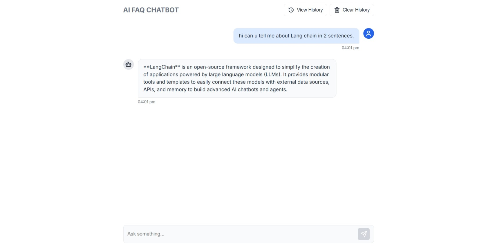
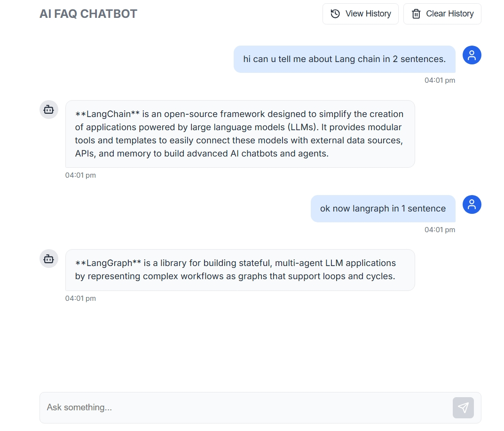
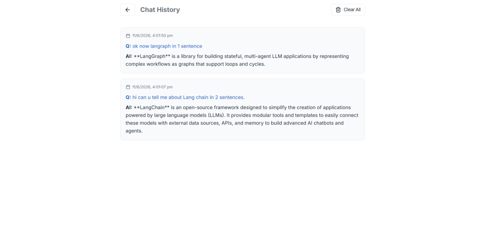
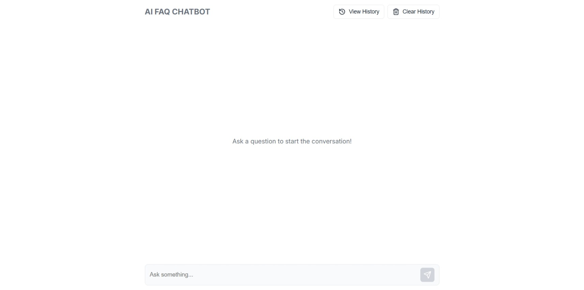
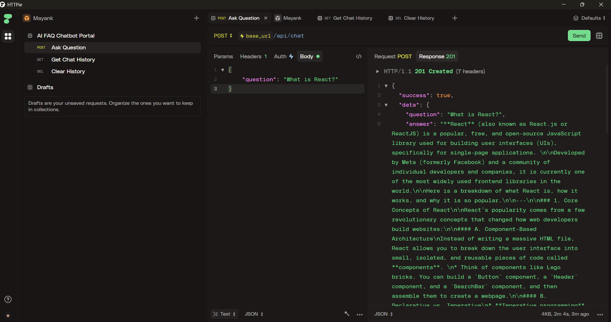
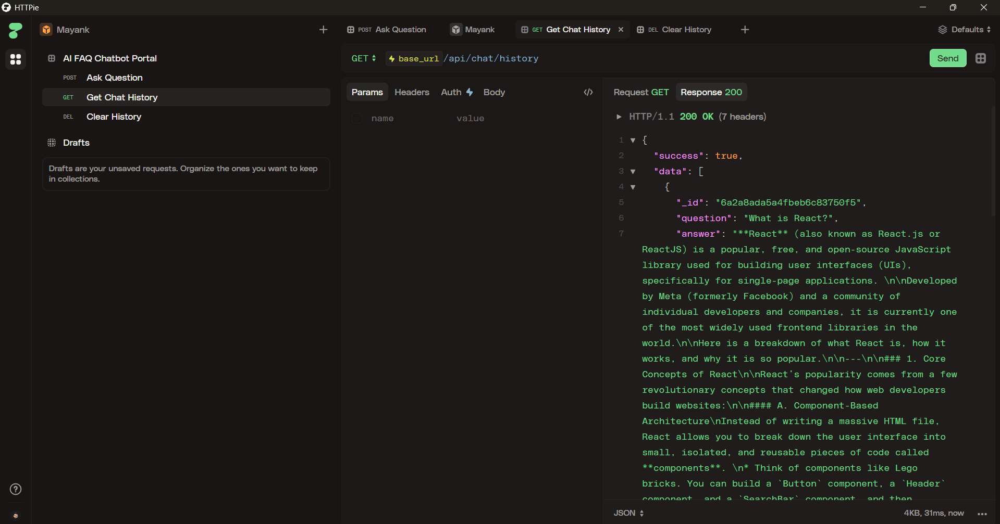
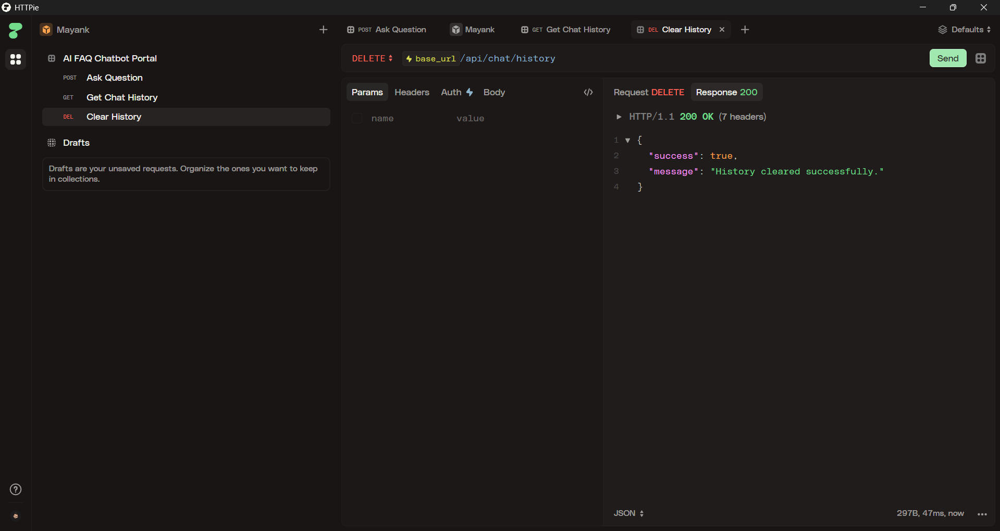
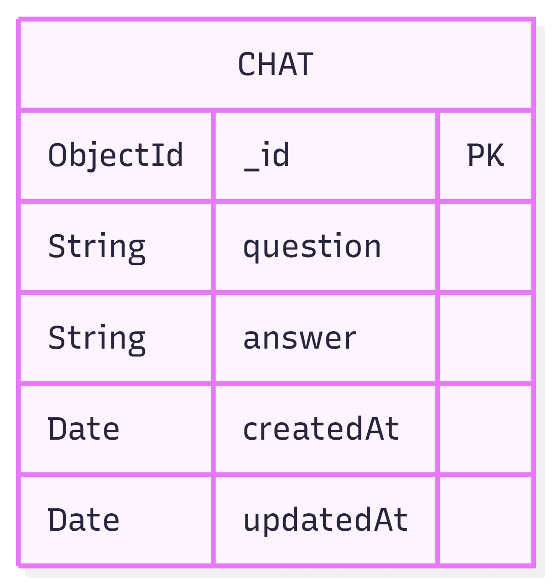

# AI FAQ Chatbot Portal

A full-stack AI-powered FAQ Chatbot Portal where users can ask questions and receive AI-generated responses using the Google Gemini API.

## Features

- **AI-Powered Responses:** Integrated with Google Gemini API (`gemini-2.5-flash`).
- **Chat History:** Conversations are stored in MongoDB and persisted across sessions.
- **Clear History:** Ability to delete all previous chat records.
- **Responsive Design:** Mobile-friendly ChatGPT-style interface.
- **Loading Indicators:** Visual feedback while the AI generates responses.
- **Error Handling:** Graceful handling of API and network errors.

## Screenshots

### UI Preview
| Home Screen | Chat View |
| :---: | :---: |
|  |  |

| History View | Mobile View |
| :---: | :---: |
|  |  |

## Tech Stack

- **Frontend:** React.js, Axios, Lucide Icons, Vanilla CSS
- **Backend:** Node.js, Express.js
- **Database:** MongoDB, Mongoose
- **AI Service:** Google Gemini API

## Getting Started

### Prerequisites

- Node.js installed
- MongoDB URI (Local or Atlas)
- Google Gemini API Key

### Backend Setup

1. Navigate to the `server` directory:
   ```bash
   cd server
   ```
2. Install dependencies:
   ```bash
   npm install
   ```
3. Create a `.env` file based on `.env.example`:
   ```env
   PORT=5000
   MONGO_URI=your_mongodb_connection_string
   GEMINI_API_KEY=your_gemini_api_key
   ```
4. Start the server:
   ```bash
   npm run dev
   ```

### Frontend Setup

1. Navigate to the `client` directory:
   ```bash
   cd client
   ```
2. Install dependencies:
   ```bash
   npm install
   ```
3. Start the development server:
   ```bash
   npm run dev
   ```

## API Endpoints

### Visual API Documentation (Postman)
| Ask Question | Get Chat History |
| :---: | :---: |
|  |  |

| Clear History | Database Schema |
| :---: | :---: |
|  |  |

- `POST /api/chat` - Ask a question and get an AI response.
- `GET /api/chat/history` - Retrieve all previous chat records.
- `DELETE /api/chat/history` - Clear all chat records.

## Deployment

- **Frontend:** Recommended to deploy on Vercel.
- **Backend:** Recommended to deploy on Render or Heroku.
- **Database:** MongoDB Atlas.

## License

This project is licensed under the ISC License.
